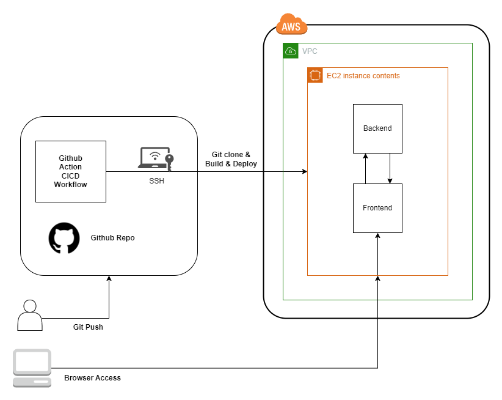

# sql_convert_app
 SQL convert app practice

## ローカル環境構築手順

* Docker Desktop をインストールしておくこと

### 1. リポジトリをクローンする

```
$ git clone　
```

### 2. ディレクトリに移動する

```
$ cd sql_convert_app
```

### 3. dockerをインストールする

### 4. docker-compose.ymlを元にコンテナを起動する

```
$ docker-compose up -d --build
```

### 5. docker-compose psでコンテナが起動していることを確認する

```
$ docker-compose ps
```

### 6. ブラウザでアクセスする

```
http://localhost/
```

### 7. コンテナを停止＆削除する

```
$ docker-compose down --rmi all --volumes --remove-orphans
```

## Github ActionsでのCI/CD (EC2環境構築手順)

### 1. Github ActionsでのCI/CDの設定

すでに設定済み(/.github/workflows/github-actions-ec2.yml)

### 2. EC2インスタンスを作成する (security groupの設定を忘れずに)

### 3. EC2インスタンスに接続する

### 4. dockerをインストールする

* [Dockerのインストール](https://docs.docker.com/engine/install/ubuntu/)

### 5. git secretを設定する

settings > secrets and variables > actions > New repository secret

```
EC2_SSH_KEY=EC2インスタンスのSSHキー
HOST_DNS=EC2インスタンスのパブリックDNS
TARGET_DIR=EC2インスタンスのデプロイ先ディレクトリ
USERNAME=EC2インスタンスのユーザー名
```

### 6. run github actions or commit code to master branch

### 7. ブラウザでアクセスする

このURLにアクセスする

```
http://<EC2インスタンスのパブリックIPアドレス>/
```

## EC2環境構築手順

### 1. EC2インスタンスを作成する (security groupの設定を忘れずに)

### 2. EC2インスタンスに接続する

### 3. リポジトリをクローンする

```
$ git clone　
```

### 4. ディレクトリに移動する

```
$ cd sql_convert_app
```

### 5. dockerをインストールする

* [Dockerのインストール](https://docs.docker.com/engine/install/ubuntu/)

### 6. docker-compose.ymlを元にコンテナを起動する

```
$ docker compose up -d --build
```

### 7. docker compose psでコンテナが起動していることを確認する

```
$ docker compose ps
```

### 8. ブラウザでアクセスする

このURLにアクセスする

```
http://localhost/
```

もしくは、EC2インスタンスのパブリックIPアドレスにアクセスする

```
http://<EC2インスタンスのパブリックIPアドレス>/
```

### 9. コンテナを停止＆削除する

```
$ docker-compose down --rmi all --volumes --remove-orphans
```

## テスト実行方法 (ローカル環境を使う場合)

### 1. ディレクトリに移動する

```
$ cd backend
```

### 2. テストを実行する

```
$ pytest
```

## テスト実行方法 (docker-composeを使う場合)

### 1. docker-compose.ymlを元にコンテナを起動する

```
$ docker-compose -f docker-compose.test.yml up --build
```

## アーキテクチャ


